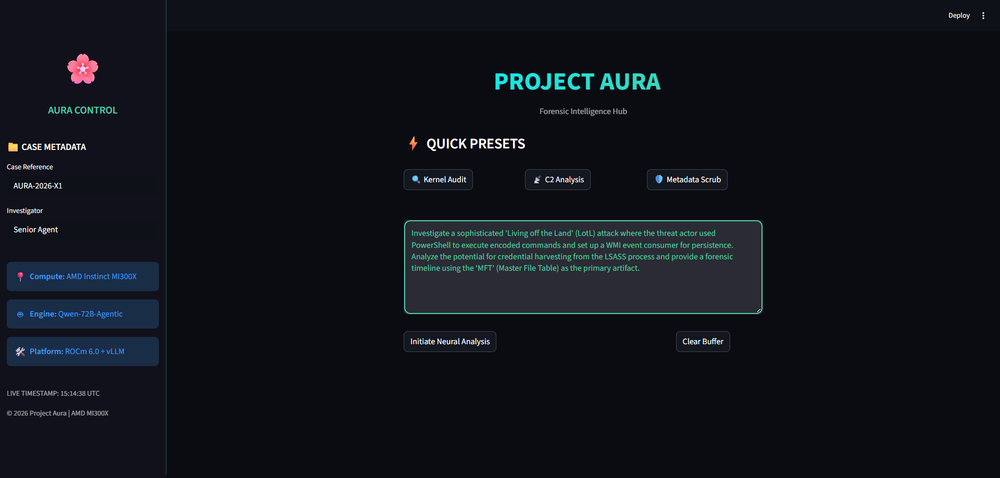
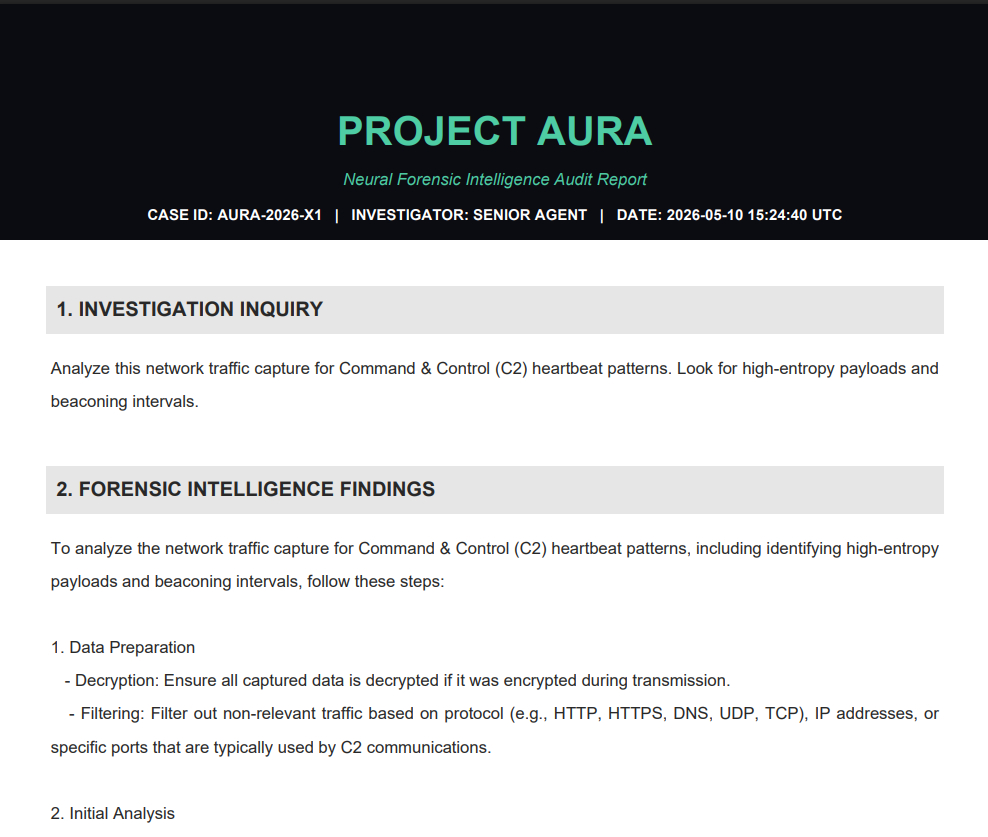

<div align="center">

# 🌌 PROJECT AURA: Intelligence Redefined
### *Forensic Artifact Reconstruction via AMD Instinct™ MI300X Acceleration*

[](https://www.amd.com/en/products/accelerators/instinct/mi300/mi300x.html)
[](https://rocm.docs.amd.com/)
[](https://www.python.org/)
[](https://streamlit.io/)
[](https://github.com/vllm-project/vllm)

[**🎥 Video Demo**](https://youtu.be/YilCJiH-B7w) | [**🤗 Hugging Face Space**](https://huggingface.co/spaces/MAhsaanUllah/Project-Aura-Forensic-Hub)

---

### "The high-entropy reasoning pipeline for modern digital forensics."

</div>

## 📖 Overview

**Project Aura** is a high-performance forensic intelligence engine engineered specifically for the **AMD Global Hackathon**. It harnesses the massive parallel compute and 192GB HBM3 VRAM of the **AMD Instinct™ MI300X** to perform real-time reconstruction of digital forensic artifacts. 

By integrating **vLLM** and **ROCm™ 6.0**, Aura provides investigators with a sophisticated reasoning pipeline capable of auditing complex system logs, memory dumps, and metadata anomalies with unprecedented speed and precision.

---

## 🚀 Key Forensic Capabilities

| Feature | Intelligence Impact |
| :--- | :--- |
| **🧠 Neural Forensic Analysis** | Deep-trace reconstruction using the Qwen-72B-Agentic model. |
| **📁 Case Metadata Hub** | Integrated Case ID and Investigator tracking for official audit trails. |
| **⚡ Quick Presets** | Instant templates for Kernel, Network, and Metadata investigations. |
| **🏎️ MI300X Acceleration** | Optimized inference leveraging 192GB VRAM for massive context windows. |
| **🛡️ Court-Ready Reporting** | Instant generation of tamper-proof, high-fidelity PDF forensic reports. |
| **📡 Real-time Pipeline** | Low-latency response via vLLM's continuous batching on AMD hardware. |

---

## 📸 System Preview

<div align="center">
  <h3>Unified Forensic Interface</h3>
  
  
  <br><br>
  
  <h3>Professional Audit Reporting</h3>
  
</div>

---

## 🛠️ Infrastructure & Technical Stack

Built on Tier-1 AI infrastructure designed for enterprise-grade forensic auditing.

*   **Compute:** AMD Instinct™ MI300X (HBM3 192GB)
*   **Platform:** AMD ROCm™ 6.0 (Open Software Stack)
*   **Inference:** vLLM (Optimized for AMD)
*   **Model:** Qwen-72B-Agentic-Reasoner
*   **Interface:** Python 3.12 & Streamlit

---

## 🔍 Investigation Case Studies

*   **Metadata Audit:** "Analyze suspicious PDF for 'Incremental Updates'." → **ALERT:** DocChecksum mismatch at Offset 0x4A2.
*   **Ransomware Timeline:** "Reconstruct kernel-level API call logs." → **TIMELINE:** Shadow Copy deletion identified at 14:02 UTC.
*   **Network Forensic:** "Identify C2 heartbeat in encrypted traffic logs." → **SIGNAL:** Entropy spike detected in TLS handshake.

---

## ⚙️ Setup & Installation

### 1. Local Environment
```bash
git clone https://github.com/MAhsaanUllah/Project-Aura-Forensic-Hub.git
cd Project-Aura-Forensic-Hub
pip install -r requirements.txt
```

### 2. Launching Aura
```bash
streamlit run src/app.py
```

---

## 📄 License & Attribution

Developed for the **AMD Global Hackathon 2026** by **Muhammad Ahsaan Ullah**.  
Built with ❤️ on the **AMD Instinct™ MI300X**.

---
<div align="center">
  <sub>© 2026 Project Aura | Secure • Scalable • Intelligent</sub>
</div>
